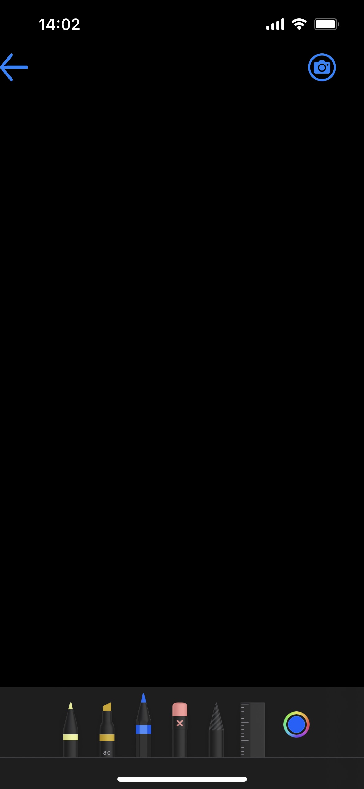
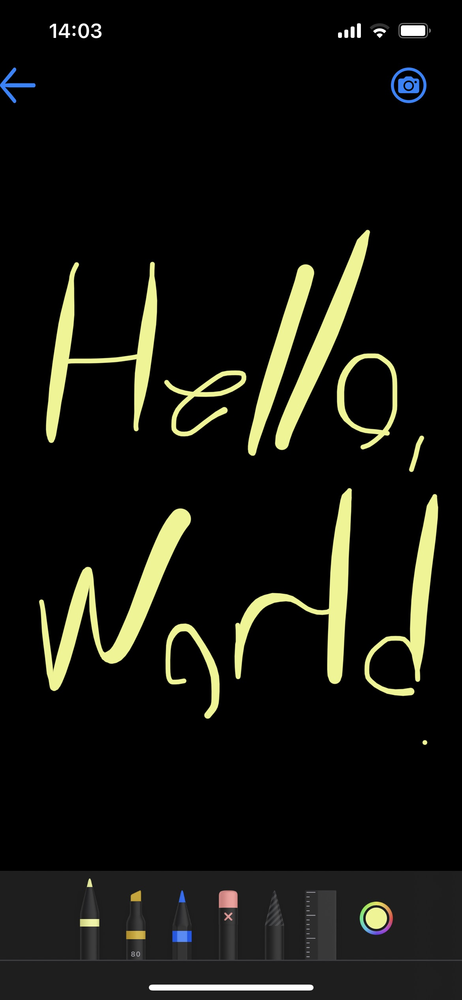
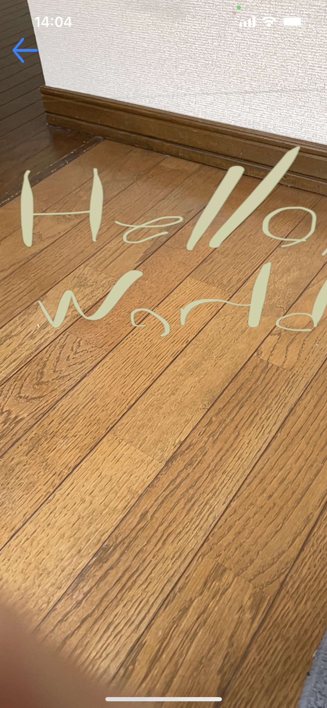
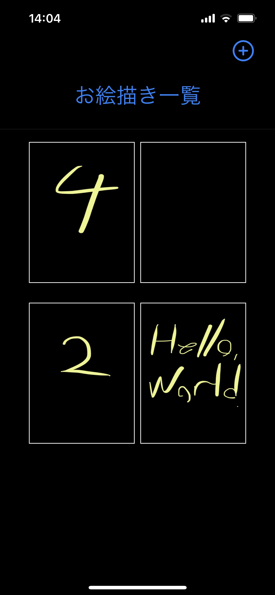

# AR 練習用アプリ

## 概要

ユーザーに iPhone 上で絵を描いてもらい、書いた絵を AR で表示させるアプリ

## 機能

- お絵描き
- 絵の編集
- 絵の一覧表示
- AR 表示

## ToDo

- 絵のタイトルの追加・表示・変更
- 絵の削除
- デバイスへの保存
- クラウドへの保存
- 作成した AR のダウンロード
- UI の改善

## 画面

### トップ画面 1

### キャンバス 1

### キャンバス 2

### AR

### トップ画面 2

